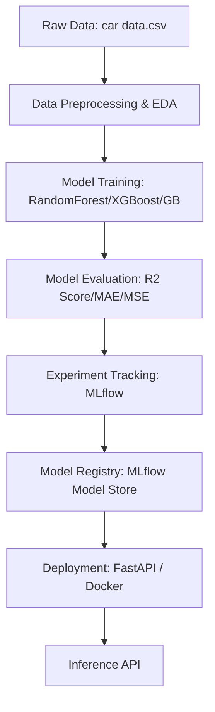

# Cars Prediction Price MLOPS System

**Car Price Prediction** is a simple machine learning project that predicts used car prices using regression models. The repository includes an exploratory notebook, a trained model evaluation report, a small dataset, and a FastAPI app for serving predictions.

---

## 🏗 Project Architecture
The system follows a standard MLOps lifecycle to ensure reproducibility, scalability, and ease of deployment.



### Key Components
1. **Data Layer**: Standard CSV storage with Pandas preprocessing.
2. **Experimentation**: MLflow Tracking for logging metrics and model parameters.
3. **Serving Layer**: FastAPI for high-performance inference.
4. **Containerization**: Docker for environment consistency across stages.

## 📊 Dataset & Features
The project predicts the selling price of cars based on several features:

- **Year**: Manufacturing year of the car.
- **Selling_Price**: Target variable (Price in lakhs).
- **Present_Price**: Current showroom price.
- **Kms_Driven**: Total mileage.
- **Fuel_Type**: Petrol, Diesel, or CNG.
- **Seller_Type**: Dealer or Individual.
- **Transmission**: Manual or Automatic.
- **Owner**: Number of previous owners.

## 📈 Model Performance
Based on experiments, the **Gradient Boosting Regressor** emerged as the top-performing model:

| Model | R2 Score | MAE | MSE | RMSE |
| :--- | :--- | :--- | :--- | :--- |
| **Gradient Boosting** | **0.9528** | 0.4839 | 0.4429 | 0.6655 |
| XGBoost | 0.9386 | 0.5011 | 0.5762 | 0.7591 |
| Random Forest | 0.9280 | 0.4999 | 0.6765 | 0.8225 |
| Linear Regression | 0.7564 | 1.0822 | 2.2878 | 1.5125 |

## 🚀 Deployment & MLOps
This project is equipped with:
- **MLflow**: Track every run and manage model versions.
- **Docker**: Easily containerize the application for any cloud environment.
- **FastAPI**: A ready-to-use production server for real-time predictions.

### Running with MLflow
To log the current best model:
```bash
python log_to_mlflow.py
```

To serve the model using MLflow:
```bash
mlflow models serve -m "models:/CarPriceModel/latest" --port 5001
```

---

## ⚙️ Setup & Installation

1. Clone the repository:

   ```bash
   git clone <repository-url>
   cd "Car Price Prediction"
   ```

2. (Recommended) Create and activate a virtual environment:

   Windows (PowerShell):
   ```powershell
   python -m venv .venv
   .\.venv\Scripts\Activate.ps1
   ```

3. Install dependencies:

   ```bash
   pip install -r requirements.txt
   ```

---

## 🚀 Usage

### Run the analysis notebook

Open `cars_price_pred.ipynb` in Jupyter or VS Code and run the cells to reproduce data exploration, preprocessing, training, and evaluation steps.

### Run the API locally

1. Start the API:

```bash
python DeployfastApi.py
```

2. By default, the app will be served (e.g., at `http://127.0.0.1:8000`). Use the interactive docs at `/docs` to test prediction endpoints.

### Docker (optional)

Build and run the Docker container:

```bash
docker build -t car-price-api -f dockerfile .
docker run -p 8000:8000 car-price-api
```

---

## 🧪 Model & Evaluation

- The notebook contains the training pipeline and model selection.
- Results and metrics (MAE, RMSE, R^2) are available in `regression_report.csv`.
- Tips to improve performance: feature engineering, hyperparameter tuning, and using ensemble models.

---

## 🛠️ Contributing

Contributions are welcome — please open an issue or submit a pull request with improvements, bug fixes, or new features.

---

## 📄 License

This project is provided under the MIT License (or replace with your chosen license).

---

## ✉️ Contact

For questions or feedback, open an issue or reach out via the repository contact information.


**Happy modeling!** ✅
