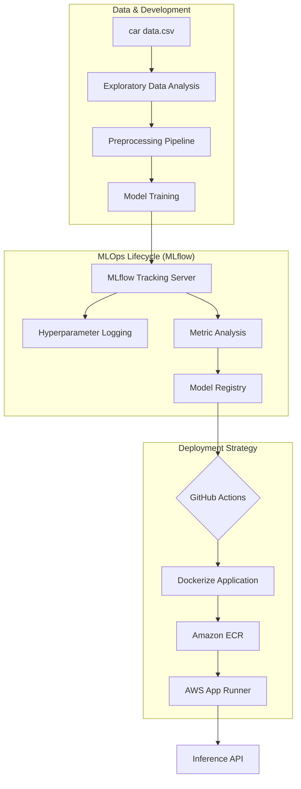

# 🚗 Cars Prediction Price MLOPS System

[](https://mlflow.org/)
[](https://fastapi.tiangolo.com/)
[](https://www.docker.com/)
[](https://aws.amazon.com/apprunner/)

A production-grade End-to-End MLOps pipeline for predicting used car prices. This system integrates experiment tracking, model versioning, automated CI/CD, and scalable cloud deployment.

---

## 🏗 System Architecture

The project implements a robust MLOps lifecycle designed for scalability and reproducibility.



### 🛠 Core MLOps Components
*   **Tracking**: Centralized logging of every experiment run using **MLflow**.
*   **Registry**: Version-controlled model store to manage transitions from Staging to Production.
*   **API**: High-performance RESTful API built with **FastAPI**.
*   **Infrastructure**: Fully containerized with **Docker** and deployed on **AWS App Runner**.

---

## 📁 Project Structure

```text
.
├── .github/workflows/
│   ├── aws_deploy.yml           # CI/CD: Automated AWS App Runner Deployment
│   └── python-publish.yml       # CI/CD: Automated Package Publishing
├── car data.csv                 # Dataset: Raw Vehicle Information
├── cars_price_pred.ipynb        # Lab-Bench: Interactive Analysis & Prototype
├── car_price_prediction_model.pkl # Artifact: Serialized Scikit-Learn Model
├── regression_report.csv        # Benchmarks: Comparative Analytics
├── DeployfastApi.py             # App: Production Inference Engine
├── log_to_mlflow.py             # DevOps: MLflow Logging & Registry Migration
├── MLproject                    # MLOps: Project Entry Definition
├── conda.yaml                   # Environment: MLflow Spec (Conda)
├── dockerfile                   # DevOps: Container Image Definition
├── requirements.txt             # Environment: Python Dependencies
└── carspricepred.yml            # Legacy: Heroku Workflow
```

---

## 📈 Engineering Performance Metrics

After rigorous evaluation across multiple algorithms, the **Gradient Boosting Regressor** was selected as the champion model for its superior accuracy and low generalization error.

| Algorithm | R² Score | MAE | RMSE |
| :--- | :--- | :--- | :--- |
| **Gradient Boosting** | **0.9528** | **0.4839** | **0.6655** |
| XGBoost | 0.9386 | 0.5011 | 0.7591 |
| Random Forest | 0.9280 | 0.4999 | 0.8225 |
| Linear Regression | 0.7564 | 1.0822 | 1.5125 |

---

## 🚀 Deployment Guide

### 1. Local Development
```bash
# Clone the system
git clone https://github.com/AbubakrDA/Cars-Prediction-Price-MLOPS-System.git
cd Cars-Prediction-Price-MLOPS-System

# Setup Environment
python -m venv venv
source venv/Scripts/activate  # venv\Scripts\activate on Windows
pip install -r requirements.txt
```

### 2. MLOps Workflow with MLflow
Log the best model and parameters to the local tracking server:
```bash
python log_to_mlflow.py
# Start MLflow UI
mlflow ui
```

### 3. ☁️ CI/CD MLOps Pipeline
The project features a professional-grade **GitHub Actions** pipeline (`mlops_ci_cd.yml`) that automates the entire lifecycle:

1.  **Code Quality (Lint)**: Static analysis with `flake8` to ensure PEP8 compliance.
2.  **Unit Tests & Model Validation**: Automated testing with `pytest` to verify API logic and model artifact integrity.
3.  **Containerization**: Building and pushing the optimized Docker image to **Amazon ECR**.
4.  **Continuous Deployment**: Automated rollout to **AWS App Runner** on every push to `main`.

---

## 🧪 Inference API Usage
Once deployed, interactions with the system are handled via POST requests:

**Endpoint:** `/predict`
**Payload:**
```json
{
  "Present_Price": 5.59,
  "Kms_Driven": 27000,
  "Fuel_Type": 0,
  "Seller_Type": 0,
  "Transmission": 0,
  "Owner": 0,
  "age": 10
}
```

---

## 🤝 Roadmap & Continuous Improvement
- [ ] Integration of DVC for Data Version Control.
- [ ] Automated monitoring for Data Drift and Model Decay.
- [ ] Multi-region AWS deployment using Terraform.

---

*Authored with precision by an MLOps mindset.* 🚀
